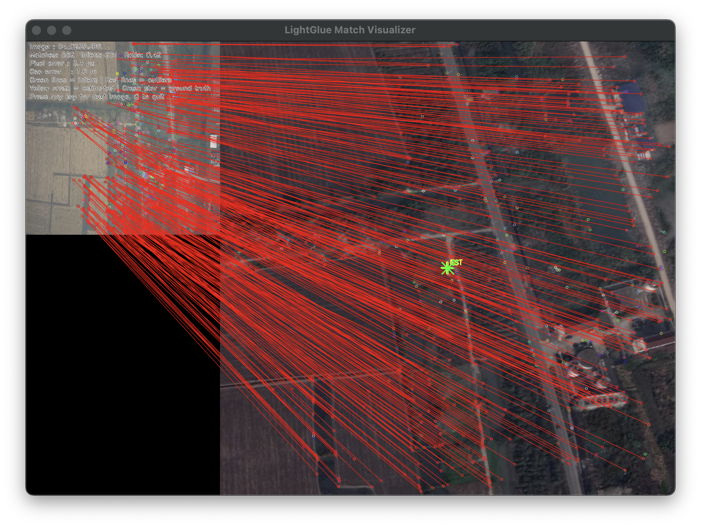

# satellite-aided-vio

Exploring satellite-image-based drift correction for GPS-denied drone navigation. Benchmarks classical and learning-based feature matchers for drone-to-satellite image matching.

---

## Overview

GPS-denied UAV navigation relies on Visual-Inertial Odometry (VIO) to estimate position using only a monocular camera and IMU. While VIO provides accurate high-frequency state estimation, it accumulates drift over time — small errors compound into large position errors over long flights.

This project implements a **"local estimation, global correction"** architecture:

- **VINS-Mono** handles continuous high-frequency pose estimation via visual-inertial odometry
- A **satellite-image-based correction module** periodically matches the drone's camera feed against preloaded satellite map tiles to recover a globally consistent position and correct accumulated drift

The correction module operates without GPS, using only preloaded satellite imagery stored onboard the drone's compute platform.

---

## System Architecture

```
┌─────────────────────────────────────────────────────┐
│                   Drone Onboard                      │
│                                                      │
│  Monocular Camera ──┐                                │
│                     ├──► VINS-Mono ──► Pose Estimate │
│  IMU ───────────────┘         │                      │
│                               │ (periodic trigger)   │
│                               ▼                      │
│              Satellite Correction Module             │
│         ┌─────────────────────────────────┐          │
│         │ 1. Crop satellite patch around  │          │
│         │    estimated position           │          │
│         │ 2. Match drone image against    │          │
│         │    satellite patch (LightGlue)  │          │
│         │ 3. Confidence gate              │          │
│         │ 4. Publish corrected position   │          │
│         └─────────────────────────────────┘          │
│                               │                      │
│                               ▼                      │
│                    Corrected Global Position         │
└─────────────────────────────────────────────────────┘
```

---

## Satellite Matching Module

The core challenge is matching a tilted, low-altitude drone camera image against a top-down orthographic satellite tile — two images of the same location captured by completely different sensors at different scales, viewpoints, and lighting conditions.

Three feature matching approaches were benchmarked:

| Matcher | Mean Error | Median Error | Success Rate | Notes |
|---|---|---|---|---|
| ORB + BF | 109.3 m | 108.6 m | 100% | Low inlier ratio (0.096); matches mostly wrong |
| SIFT + FLANN (ratio=0.85) | 81.9 m | 69.8 m | 100% | Better descriptors; 25% improvement over ORB |
| **LightGlue + SuperPoint** | **96.6 m** | **29.4 m** | 95% | Bimodal — excellent or catastrophic |

> Note: Mean and median diverge significantly for LightGlue due to occasional catastrophic failures on low-texture scenes (roads, rivers, featureless fields).

### Confidence Gate

A key insight from benchmarking: without filtering, LightGlue occasionally fits homographies to entirely wrong correspondences, producing position errors in the thousands of metres. Injecting a wrong correction into VINS-Mono is far more damaging than skipping a correction entirely.

A confidence gate filters match results before they are used as corrections:

- **Minimum inlier count:** 15
- **Minimum inlier ratio:** 0.20

**Gated results on UAV-VisLoc Scene 03 (768 images):**

| Metric | All Matches | Gate-Accepted (19.4%) |
|---|---|---|
| Mean error | 179.8 m | **19.0 m** |
| Median error | 97.2 m | **18.1 m** |
| Std | 625.0 m | **9.4 m** |
| Max error | 11819.8 m | **57.0 m** |

**Gated results on UAV-VisLoc Scene 04 (738 images):**

| Metric | All Matches | Gate-Accepted (44.2%) |
|---|---|---|
| Mean error | 248.1 m | **36.9 m** |
| Median error | 57.4 m | **32.4 m** |
| Std | 2147.4 m | **32.5 m** |
| Max error | 53933.1 m | **381.8 m** |

The gate accepts roughly 1 in 5 correction attempts on scene 03 and nearly 1 in 2 on scene 04, delivering consistent sub-40m corrections while rejecting catastrophic failures entirely.

---

## Demo



*LightGlue match between drone image (left) and satellite patch (right). Green lines show geometrically consistent inlier matches. Yellow cross marks the estimated drone position; green star marks GPS ground truth.*

---

## Dataset

Benchmarked on [UAV-VisLoc](https://github.com/IntelliSensing/UAV-VisLoc) — a large-scale dataset for UAV visual localization containing drone images paired with georeferenced satellite TIF maps and GPS ground truth (lat, lon, height, pitch, roll, yaw) per image.

---

## Repository Structure

```
satellite-aided-vio/
├── benchmark_orb.py              # ORB + BF matcher benchmark
├── benchmark_sift.py             # SIFT + FLANN matcher benchmark
├── benchmark_lightglue.py        # LightGlue + SuperPoint benchmark with confidence gate
├── visualize_matches.py          # ORB match visualizer
├── visualize_matches_lightglue.py# LightGlue match visualizer (best/worst/random modes)
├── rectify.py                    # Drone image pre-rectification using pitch/roll angles
├── app_v1.py                     # Early GCS demo with satellite map overlay
└── assets/
    └── demo.png                  # Sample LightGlue match visualization
```

---

## Setup

```bash
# Clone the repo
git clone https://github.com/PurveshGhedia/satellite-aided-vio.git
cd satellite-aided-vio

# Install dependencies
pip install opencv-python rasterio numpy lightglue
pip install git+https://github.com/cvg/LightGlue.git
```

---

## Usage

**Run LightGlue benchmark on a scene:**
```bash
python benchmark_lightglue.py \
  --dataset /path/to/UAV_VisLoc_dataset \
  --scene 03 \
  --min_inliers 15 \
  --min_inlier_ratio 0.20 \
  --output results.csv
```

**Visualize best/worst matches:**
```bash
python visualize_matches_lightglue.py \
  --dataset /path/to/UAV_VisLoc_dataset \
  --results results.csv \
  --scene 03 \
  --mode best \
  --n 5
```

---

## Hardware

Developed and tested on:
- MacBook Pro M1 (development, benchmarking)
- NVIDIA Jetson Orin Nano (target edge deployment platform)
- ROS Noetic via Docker (AMD64 emulation on Apple Silicon)

---

## Status

- [x] ORB, SIFT, LightGlue benchmarks on UAV-VisLoc
- [x] Confidence gate for reliable correction filtering
- [x] Visualization tooling for match analysis
- [ ] Integration with VINS-Mono pose topics via ROS
- [ ] End-to-end closed-loop testing on Jetson
- [ ] Real camera feed testing with live satellite correction

---

## References

- [VINS-Mono](https://github.com/HKUST-Aerial-Robotics/VINS-Mono) — Robust and Versatile Monocular Visual-Inertial State Estimator
- [LightGlue](https://github.com/cvg/LightGlue) — Local Feature Matching at Light Speed
- [UAV-VisLoc](https://github.com/IntelliSensing/UAV-VisLoc) — A Large-scale Dataset for UAV Visual Localization
- [FoundLoc](https://arxiv.org/abs/2310.16299) — Foundation Model-based Indoor Localization (CMU)
